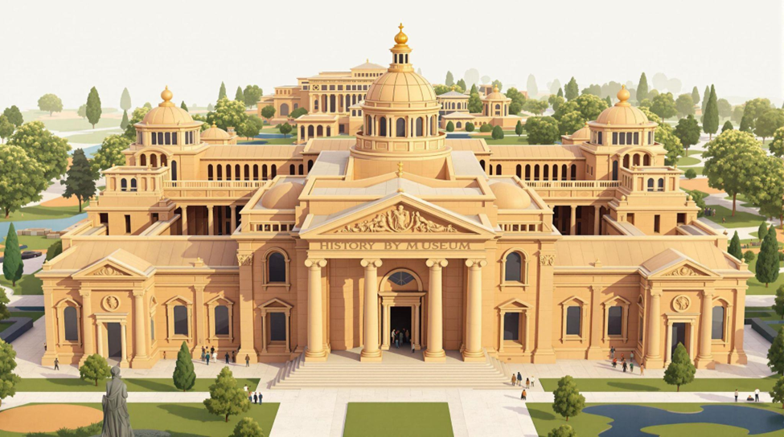
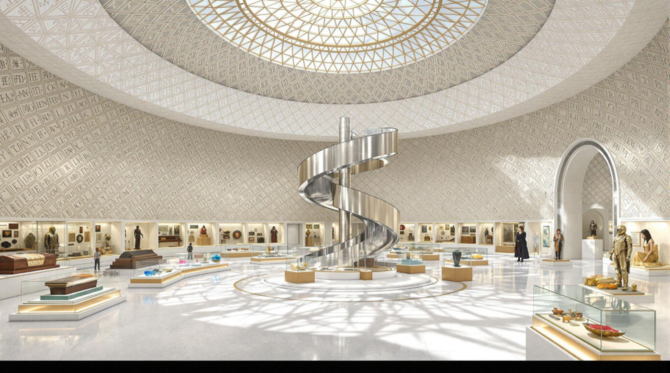
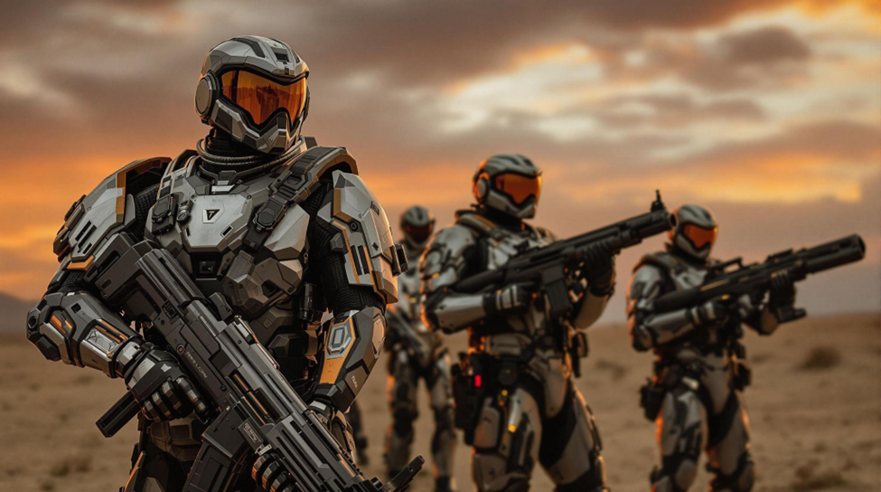
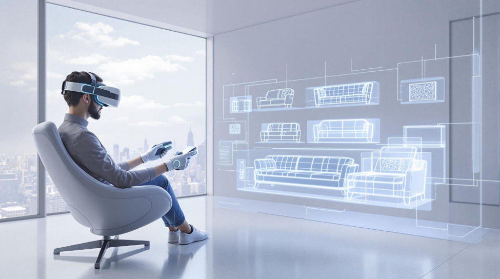
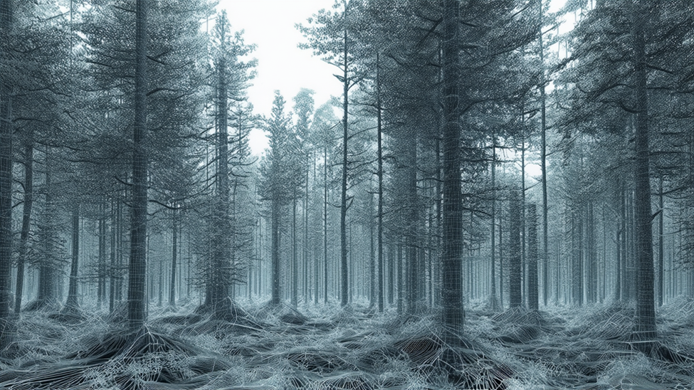
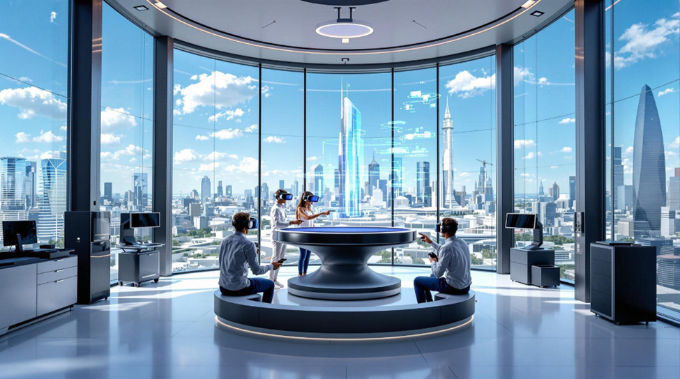
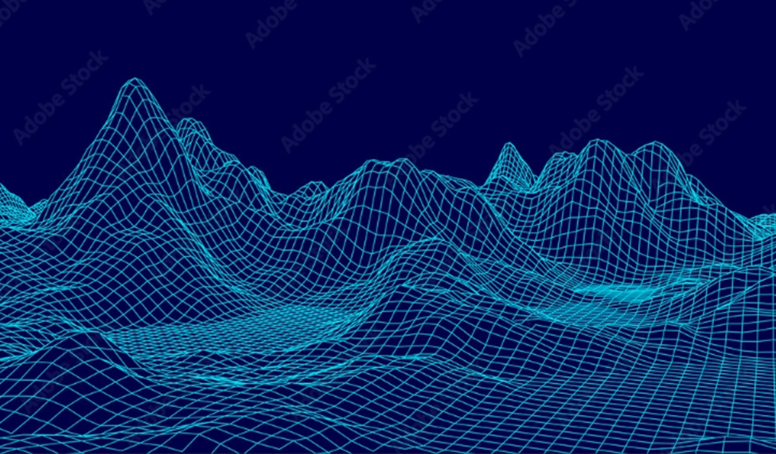
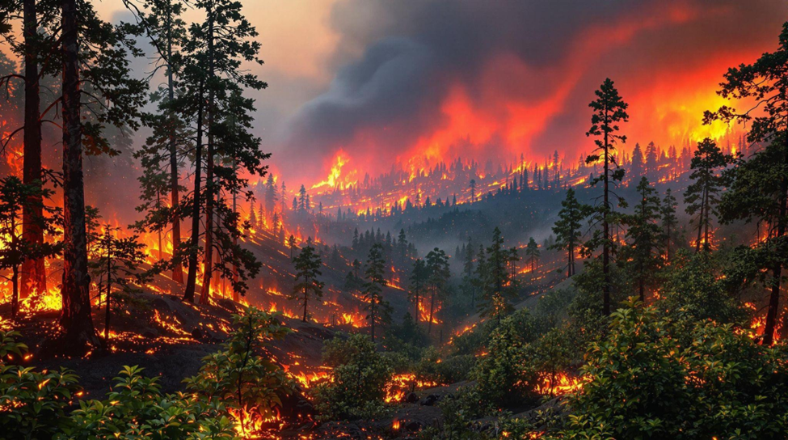

### Link your theory in here

### Virtual Reality Modeling
In the context of virtual reality (VR), "modeling" typically refers to the creation of 3D virtual objects or environments that users can interact with. This process involves using computer software to design and construct virtual models, which can represent anything from simple shapes to complex landscapes or intricate objects.

### Bringing Virtual Worlds to Life: The Magic of 3D Modeling
Ever wondered how virtual reality worlds come to life? Whether it’s a futuristic city in a game, a cozy virtual living room, or an interactive training simulation, everything you see is built using 3D modeling. This process allows artists and designers to create realistic (or totally fantastical) objects and environments that make digital experiences immersive and engaging.

### Object Modeling: The Building Blocks of Virtual Worlds
Imagine walking into a beautifully designed virtual office. The chairs, desks, computers, even the tiny coffee cup on the table—each of these elements is created through object modeling. It’s like crafting digital versions of real-world objects that can be placed inside a scene.  
For example, in a VR-based museum, an artist might create detailed replicas of ancient artifacts, ensuring they look as close to the real thing as possible. In a sci-fi game, designers might build futuristic weapons or spacecraft, adding intricate details and textures to make them feel real. Whether it’s a simple wooden stool or a high-tech robotic arm, object modeling brings individual items to life in a virtual world.

### Environment Modeling: Creating Immersive Spaces
Now, imagine stepping outside that office and finding yourself in a bustling virtual city. The towering buildings, winding roads, streetlights, and even the trees swaying in the wind—all of this comes under environment modeling. It’s not just about creating individual objects but designing entire spaces that feel natural and immersive.  
Think about open-world video games like Minecraft or Grand Theft Auto, where entire cities, forests, and oceans are built for players to explore. Or consider architectural visualization, where designers construct digital versions of real-world buildings to help clients visualize projects before they’re built. Even in virtual training simulations—like a VR firefighter drill where users navigate a burning building—environment modeling plays a crucial role in making the experience realistic and effective.

### Why 3D Modeling Matters
3D modeling is the backbone of virtual content creation, enabling artists, designers, and developers to build visually stunning and interactive digital spaces. Whether it’s for games, virtual reality, education, architecture, or even medical training, the ability to create detailed objects and environments makes virtual experiences more engaging and lifelike.  
So next time you step into a VR world or play your favorite game, take a moment to appreciate the craftsmanship behind every little object and vast landscape—it’s all thanks to the magic of 3D modeling!

---

